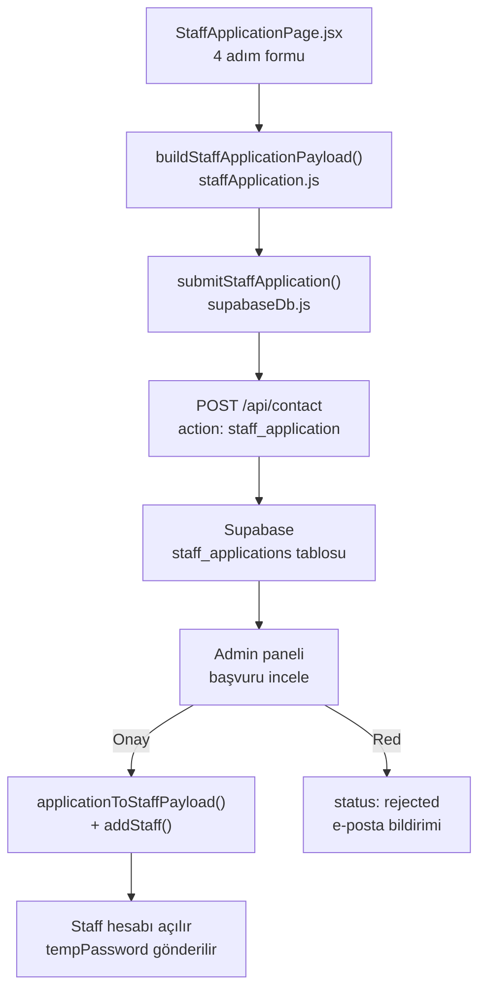
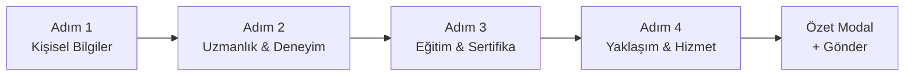

# Personel Başvuru Formu — Detaylı Analiz & Düzeltme Raporu

## Mevcut Veri Akışı



---

## KOC (COACH) Başvuru Analizi

### Adım Yapısı (mevcut)



### Sorun K-1: Eğitim Düzeyi Listesi Eksik

Dosya: [`src/data/staffApplication.js`](src/data/staffApplication.js) (satır 8-12)

```javascript
export const EDUCATION_LEVELS = [
  { value: 'lise', label: 'Lise' },
  { value: 'onlisans', label: 'Önlisans' },
  { value: 'lisans', label: 'Lisans' },
  // EKSIK: Yüksek Lisans, Doktora
]
```

- Fitness/egzersiz bilimi ve spor bilimleri alanında yüksek lisans oldukça yaygın
- Koç profilinde "Yüksek Lisans — Spor Bilimleri" gibi akademik ağırlık önemli bir differentiator

Düzeltme: `yukseklisans` ve `doktora` seçenekleri eklenmeli

### Sorun K-2: Sertifika Dosyaları Tek Array'de Karışıyor

Dosya: [`src/pages/StaffApplicationPage.jsx`](src/pages/StaffApplicationPage.jsx) (satır 401-456)

Federasyon belgesi, uluslararası sertifika ve branş sertifikası üçü de **aynı `certificateFiles` array'ini** kullanıyor. Silme işlemi index bazlı ama hangi dosyanın hangi sertifikaya ait olduğu `kind` alanıyla işaretlenmiyor. `buildStaffApplicationPayload`'da `kind: f.kind || 'certificate'` var ama upload sırasında kind set edilmiyor.

Düzeltme: `handleBulkCertUpload` çağrısında `kind` parametresi geçilmeli (`'federation'`, `'international'`, `'branch'`).

### Sorun K-3: Koç için `bio` Alanı Yok

`EMPTY_STAFF_APPLICATION`'da `bio: ''` var, `applicationToStaffPayload`'da `const bio = d.bio || ''` var — fakat koç başvuru adımlarının hiçbirinde bio textarea gösterilmiyor. Admin onayladığında koç profili biyografisiz açılıyor.

Düzeltme: Adım 4'e koç için opsiyonel bio/tanıtım textarea eklenmeli.

### Sorun K-4: Çalışma Günleri ve Saatleri Hiç Sorulmuyor

`applicationToStaffPayload` (satır 324-326):

```javascript
workDays: d.workDays?.length ? d.workDays : [1, 3, 5],
workStart: d.workStart || '09:00',
workEnd: d.workEnd || '17:00',
```

Staff kaydı açılırken varsayılan Pazartesi-Çarşamba-Cuma, 09:00-17:00 yazılıyor. Bu bilgi formda hiç sorulmadığı için admin onay akışında da kayıp.

Düzeltme: Adım 4'te opsiyonel "Müsaitlik / Çalışma Saatleri" bölümü eklenmeli (gün checkbox'ları + saat aralığı).

### Sorun K-5: Dil Seçimi Formda Yok

`EMPTY_STAFF_APPLICATION.languages: ['Türkçe']` set edilmiş ama formda hiç gösterilmiyor. İngilizce, Almanca vb. bilen koçlar bunu beyan edemiyor.

Düzeltme: Adım 1 sosyal medya bölümüne veya adım 4'e çok-seçimli dil bölümü eklenmeli.

### Sorun K-6: `validateStaffApplicationStep(4, ...)` Kümülatif Hata Döndürüyor

Satır 442: Step 4 validasyonu tüm önceki adım hatalarını da içeriyor. Kullanıcı adım 4'teyken adım 1'den kaynaklanan bir hata mesajı görebilir, ancak geri dönemeden formda nereden kaynaklandığını anlayamaz. Bu UX sorununa yol açıyor.

Düzeltme: Final submit validasyonu ayrı tutulmalı; adım 4 gösterimi sadece `step4Errors` kullanmalı.

---

## DİYETİSYEN Başvuru Analizi

### Sorun D-1: Adım 4 Tamamen Boş

Dosya: [`src/pages/StaffApplicationPage.jsx`](src/pages/StaffApplicationPage.jsx) (satır 554-558)

```jsx
{step === 4 && form.role === 'dietitian' && (
  <div className="rounded-2xl border border-sage-200 bg-sage-50/50 p-5 text-center text-sm text-cream-800/70">
    Diyetisyen başvurunuz tamamlandı. Devam ederek özeti görüntüleyip gönderebilirsiniz.
  </div>
)}
```

Koç için adım 4'te `WORK_APPROACHES` ve `SERVICE_AREAS` sorgulanıyor. Diyetisyen için eşdeğer hiçbir içerik yok.

Düzeltme: Diyetisyen için adım 4'e aşağıdakiler eklenmeli:
- Danışmanlık yaklaşımı (Davranışsal beslenme terapisi, Kanıta dayalı beslenme, Motivasyonel görüşme, vb.)
- Hizmet biçimi (Online, Yüz yüze, Hastane/klinik, Ev ziyareti)
- TDD üyeliği ve çalışma izni beyanı checkbox'u (sektörel zorunluluk)

### Sorun D-2: Diyetisyen Uzmanlık Listesi Yetersiz

Dosya: [`src/data/staffApplication.js`](src/data/staffApplication.js) (satır 51-54)

```javascript
export const DIETITIAN_SPECIALTIES = [
  'Spor Beslenmesi', 'Klinik Beslenme', 'Kilo Yönetimi', 'Diyabet Beslenmesi',
  'Hamilelik / Emzirme', 'Çocuk Beslenmesi', 'Plant-Based', 'Intolerans / Alerji',
]
```

8 seçenek var. Eksik kritik alanlar:
- Yaşlı Beslenmesi / Gerontoloji Beslenmesi
- Onkoloji / Kanser Beslenmesi
- Kardiyovasküler Hastalıklarda Beslenme
- Renal Diyeti (Böbrek Hastalıkları)
- Yeme Bozuklukları Beslenmesi
- Nöropsikiyatrik Hastalıklarda Beslenme
- Genel Sağlıklı Yaşam / Koruyucu Beslenme
- Sporcu Ağırlık Yönetimi (ayrı kategoride)

Türkiye'de en çok çalışılan alanlardan "Yeme Bozuklukları" ve "Onkoloji Beslenmesi" hiç yer almıyor.

Düzeltme: Liste `DIETITIAN_SPECIALTY_GROUPS` formatında gruplandırılmalı (Klinik, Spor, Özel Popülasyon, Yaşam Tarzı).

### Sorun D-3: Diyetisyen için COMPETENT_GROUPS Yok

Koç için yetkin danışan grupları (yaş, cinsiyet, hedef, özel popülasyon) detaylıca sorgulanıyor. Diyetisyenler için bu bölüm hiç yok; ancak diyetisyen profilinde hangi yaş grubu ve klinik popülasyonlara hizmet verdiği kritik bilgi.

Düzeltme: Adım 2'ye diyetisyen için sadeleştirilmiş yetkin grup seçimi eklenmeli.

### Sorun D-4: Mezuniyet Bölümü Serbest Metin — Doğrulama Yok

Türkiye'de diyetisyen olabilmek için Beslenme ve Diyetetik lisans programından (4 yıl) mezun olmak zorunlu. Ancak `graduationDepartment` tamamen serbest metin:

```jsx
<input value={form.graduationDepartment} ... placeholder="Mezuniyet bölümü *" />
```

"Aşçılık" veya "Biyoloji" yazarak form geçilebilir.

Düzeltme: Dropdown ile yaygın geçerli bölümler listelenmeli (Beslenme ve Diyetetik, Gıda Mühendisliği + uzm. vb.) ve serbest "Diğer" seçeneği eklenmeli. En azından validation'da belirli keyword kontrolü yapılmalı.

### Sorun D-5: Diyetisyen Step 3'te Eğitim/Sertifika Formu Ham Metin Girişi

Koç için yapılandırılmış sertifika sistemi var (GSB federasyon listesi, NASM/ACE gibi uluslararası sertifika chip'leri). Diyetisyen için ise tamamen serbest metin girişi (sertifika adı + kurum + yıl) var.

Yaygın diyetisyen sertifikaları chip olarak sunulmuyor:
- SCOPE (Avrupa Obezite Sertifikası)
- Enteral/Parenteral Beslenme Uygulama Sertifikası
- İBS/Gut Sertifikası
- ACE Health Coach
- Precision Nutrition Certification

Düzeltme: Koçtaki gibi diyetisyen için de yaygın sertifika chip listesi eklenmeli; serbest metin seçeneği "Diğer" olarak kalabilir.

### Sorun D-6: `dietitianStep3Errors` Kırılgan Validasyon

```javascript
const cert = (form.certificates || []).find((c) => c.name?.trim())
if (!cert) errors.push('En az bir sertifika / diploma girin')
```

Sertifika adı yazılsa bile `file` yüklemek zorunlu. Ancak diyetisyen Türk üniversitesinden mezunsa diploması zaten transkript/mezuniyet belgesiyle örtüşüyor — bunu "sertifika" kısmına mı yoksa "eğitim" kısmına mı koyacağı belirsiz.

Düzeltme: Validasyon mesajı netleştirilmeli. "Diploma veya mezuniyet belgesi en az bir eğitim satırında yüklenmeli" olmalı; sertifika ayrı opsiyonel tutulabilir.

---

## ORTAK Sorunlar

### Sorun O-1: Profil Fotoğrafı Başvuruya Dahil Edilmiyor

`StaffApplicationPage.jsx` satır 256-257:

```jsx
hint="Profil fotoğrafı başvuruya dahil edilmez; onay sonrası personel profilinizden ekleyebilirsiniz."
```

Fakat `EMPTY_STAFF_APPLICATION.photo` var ve `buildStaffApplicationPayload`'da gönderiliyor. Hint mesajı yanıltıcı ve fotoğraf yüklemenin gereksiz bant genişliği kullandığı söyleniyor ama kod göndermeye çalışıyor.

Düzeltme: Ya fotoğraf başvuruya dahil edilmeli (ve hint güncellenmeli) ya da form'dan kaldırılmalı.

### Sorun O-2: Sosyal Medya Sıralaması Sektöre Göre Yanlış

Mevcut sıra: LinkedIn → Instagram → YouTube → Website

Fitness/wellness sektöründe adaylar genellikle Instagram portföyüyle değerlendirilir, LinkedIn ikincil. Diyetisyenler için LinkedIn daha önemli olabilir ama genel sıra yeniden düzenlenmeli:
- Koç: Instagram → YouTube → LinkedIn → Website
- Diyetisyen: LinkedIn → Instagram → YouTube → Website

### Sorun O-3: Dil Seçimi Eksik (Her İki Rol)

`languages: ['Türkçe']` varsayılan — formda hiç gösterilmiyor. İkinci/üçüncü dil bilen uzmanlar bunu beyan edemiyor; admin panel profil kartında da dil bilgisi görünmüyor.

---

## Öncelik Matrisi

| Kod | Sorun | Önem | Etki | Dosya |
|-----|-------|------|------|-------|
| D-1 | Diyetisyen Adım 4 boş | Kritik | UX & veri eksikliği | StaffApplicationPage.jsx |
| D-2 | Uzmanlık listesi yetersiz | Yüksek | Sektörel uygunluk | staffApplication.js |
| D-4 | Mezuniyet bölümü kontrolsüz | Yüksek | Kalite güvencesi | staffApplication.js |
| K-1 | Eğitim düzeyi eksik | Orta | Profil eksiği | staffApplication.js |
| K-2 | Sertifika kind karışıklığı | Orta | Veri bütünlüğü | StaffApplicationPage.jsx |
| K-3 | Koç bio yok | Orta | Profil eksiği | StaffApplicationPage.jsx |
| D-3 | Diyetisyen yetkin grup yok | Orta | Profil eksiği | staffApplication.js |
| D-5 | Diyetisyen sertifika ham metin | Orta | UX & doğrulama | StaffApplicationPage.jsx |
| K-4 | Çalışma saatleri sorulmuyor | Düşük | Varsayılan veri | staffApplication.js |
| K-5 / O-3 | Dil seçimi yok | Düşük | Profil eksiği | staffApplication.js |
| O-1 | Fotoğraf hint yanıltıcı | Düşük | UX tutarsızlık | StaffApplicationPage.jsx |
| O-2 | Sosyal medya sırası yanlış | Çok düşük | UX iyileştirme | StaffApplicationPage.jsx |

---

## Uygulama Planı

Tüm değişiklikler 2 dosyada yoğunlaşıyor:
- [`src/data/staffApplication.js`](src/data/staffApplication.js) — veri tanımları + validasyon
- [`src/pages/StaffApplicationPage.jsx`](src/pages/StaffApplicationPage.jsx) — form UI

Diyetisyen adım 4 içeriği için `DIETITIAN_WORK_APPROACHES` ve `DIETITIAN_SERVICE_AREAS` constants eklenmesi gerekiyor.
