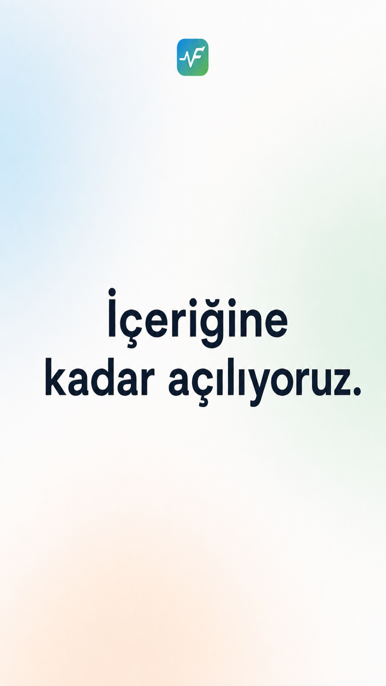
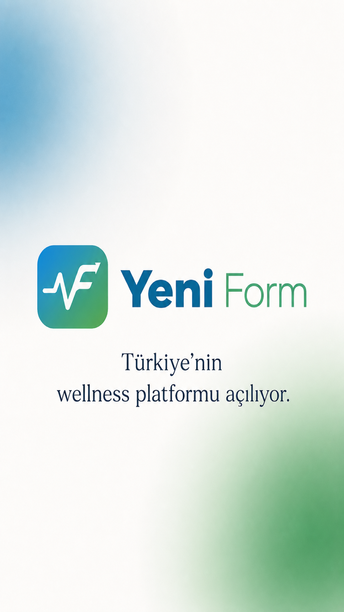
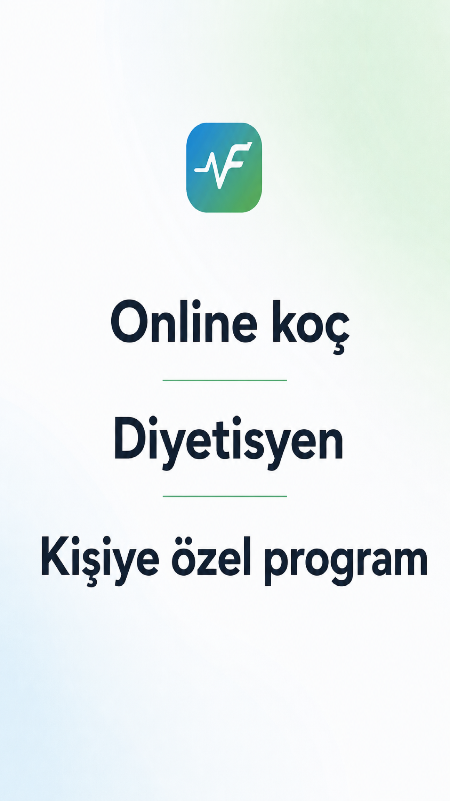
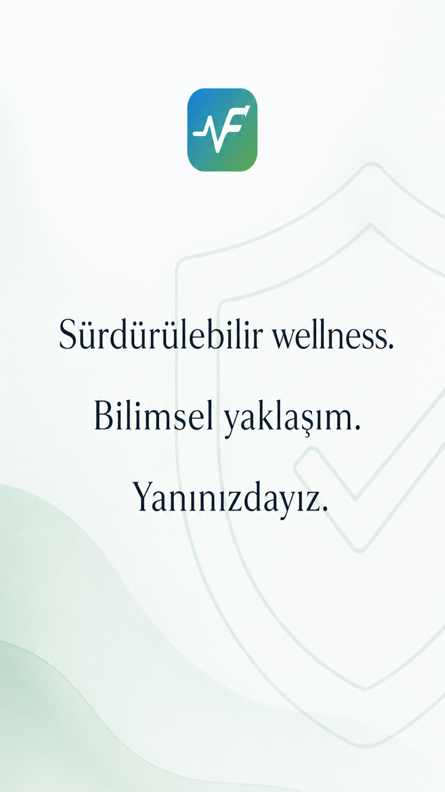
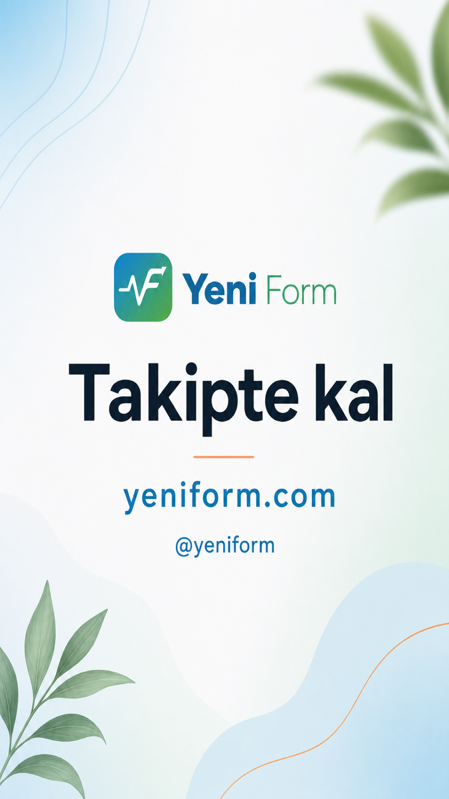

# Yeni Form — Instagram Story Launch Set

Soft launch teaser set for **@yeniform**. No hard launch date — tone is *içeriğine kadar / yakında*.

**Site:** [yeniform.com](https://yeniform.com)  
**Handle:** [@yeniform](https://instagram.com/yeniform)  
**Tagline:** Online koçluk ve online diyetisyen ile sürdürülebilir wellness

---

## Palette (locked)

| Role | Hex | Notes |
|------|-----|--------|
| Brand blue | `#2d8fc4` → `#1a455c` | Logo, URL/handle accents, soft orbs |
| Sage green | `#449664` → `#2d6242` | Value dividers, trust mesh, logo |
| Warm peach | `#e8894f` | Thin CTA accent only |
| Cream bg | `#fafbfc` | Base |
| Text | `#1a2332` | Headlines & body |
| Soft mesh | `#f0f7fb` + `#f2f9f5` + `#ffede3` | Atmospheric washes |

**Avoid:** purple/glow clichés, emoji décor, floating sticker/badge clutter, dark mode, price/stat strips, medical claims (*tedavi*, *şifa*).

---

## Assets (1080×1920 · 9:16)

| # | File | Role |
|---|------|------|
| 01 |  | Curiosity |
| 02 |  | Brand |
| 03 |  | Value |
| 04 |  | Trust |
| 05 |  | Action |

Paths:

- `./insta-post/story-01-teaser.png`
- `./insta-post/story-02-reveal.png`
- `./insta-post/story-03-value.png`
- `./insta-post/story-04-trust.png`
- `./insta-post/story-05-cta.png`

---

## Copy (on-image)

| Frame | On-image text |
|-------|----------------|
| 01 Teaser | İçeriğine kadar açılıyoruz. |
| 02 Reveal | Yeni Form · Türkiye’nin wellness platformu açılıyor |
| 03 Value | Online koç · Diyetisyen · Kişiye özel program |
| 04 Trust | Sürdürülebilir wellness. Bilimsel yaklaşım. Yanınızdayız. |
| 05 CTA | Takipte kal · yeniform.com · @yeniform |

---

## Publish order

Post as a **Story sequence** in this order (psych: curiosity → brand → value → trust → action):

1. **Teaser** — cream + soft brand/sage mesh; big type; small logo only  
2. **Reveal** — logo centered; blue→green orbs; clean clinical-wellness  
3. **Value** — three clear lines; sage accent dividers; no icon clutter  
4. **Trust** — calmer cream/sage; subtle shield/check feel  
5. **CTA** — liveliest but on-brand; peach accent; clear follow + URL  

Suggested spacing: publish 01→05 within a few minutes so the narrative reads as one arc. Keep stories up 24h; pin/highlight as **Açılış** when ready.

---

## Caption suggestion (feed cross-post or Story text add-on)

```
İçeriğine kadar açılıyoruz.

Online koçluk ve online diyetisyen ile sürdürülebilir wellness.
Yakında · yeniform.com

Takipte kal → @yeniform
```

Shorter Story-only alt:

```
Yakında. Takipte kal · yeniform.com
```

---

## Sticker / interactive notes

| Frame | Stickers | Notes |
|-------|----------|--------|
| 01 | Optional poll: “Merak ettin mi?” Evet / Daha anlat | Keep poll at bottom safe zone |
| 02 | None, or subtle “Yeni” reaction sticker | Don’t cover logo |
| 03 | Optional quiz: “Hangisi senin için?” Koç / Diyetisyen / İkisi | One question max |
| 04 | None | Let trust copy breathe |
| 05 | **Link sticker** → `yeniform.com` + **Follow** reminder | Place CTA stickers in lower third; don’t obscure `@yeniform` / URL type |

Safe zones: leave ~250px top (system UI) and ~340px bottom (reply bar) clear of critical type when adding stickers.

---

## Brand refs

- Logo: `public/brand-logo.png`
- Colors: `src/index.css` (brand blue / sage / peach / cream)
